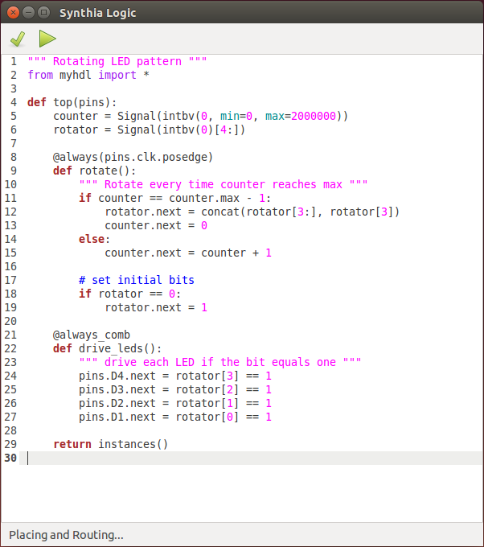

# Synthia
A simple IDE that uses myHDL, yosys, and arachne-pnr to target the ICEStick.

Written in python with glade using pygi. Looks a lot like gedit because it uses the same gtk components.

## Concept
The goal for synthia is to provide a simple path for playing with reconfigurable logic.

Arduino wasn't sucessful because it was a cheap dev board or a powerful IDE. It was succesful because it was so easy to use. Like ten lines of code and hit the play button and you are blinking an LED. Rather than using the vendor's complicated but powerful IDE and standalone C, you were looking at a text box with a simplified language, and a play button.

FPGA vendor software stacks are impractically large and inflexible for this type of application.

Project icestorm reverse engineered the bitstream format for a Lattice FPGA. This allowed for a small open source software stack to go from verilog to bitstream.

Another usability barrier is that mainstream HDL's (VHDL and Verilog) are not very conducive to writing synthesizable code without understanding how that code will be implemented on hardware.

myHDL is an alternative HDL based on python that is much more readable. Python has a reputation for readability and is widely used in the SW world, so it's syntax is both friendly and familiar.

# On a fresh Lubuntu 15.10.
# apt-get some packages :)
sudo apt-get install git python-pip clang libftdi-dev gawk tcl-dev libreadline-dev bison flex mercurial gir1.2-gtksource-3.0

# install icestorm
cd $HOME
git clone https://github.com/cliffordwolf/icestorm.git icestorm
cd icestorm && make && sudo make install
# arachne-pnr
cd $HOME
git clone https://github.com/cseed/arachne-pnr.git arachne-pnr
cd arachne-pnr && make && sudo make install

# install yosys
cd $HOME
git clone https://github.com/cliffordwolf/yosys.git yosys
cd yosys && make && sudo make install

## Development State
Basic operation works, but there are still a few pieces that are missing.

## Done

* Status bar displays current state of synthesis and download
* Displays reasonable looking errors during the toVerilog pass

## TODO

* Sort out the dependencies
  * Install this in a virtualenv and see what python packages are missing
  * Write a setup.py
* Write setup instructions
* Remove, or add functionality for buttons that currently don't do anything
* Add reasonable way in the UI to detect whether iCEStick is present
* Add the other pins on the iCEstick to the pcf and pin class
